# Microsoft 365 Security, Compliance & Monitoring Lab

## 📌 Project Overview

This project was completed as part of a Cloud Computing program and focuses on implementing security, compliance, and monitoring solutions in a Microsoft 365 environment.

It simulates real-world responsibilities of an administrator responsible for protecting organizational data, enforcing compliance policies, and monitoring system activity.

---

## 🧰 Technologies Used

* Microsoft Defender for Office 365
* Microsoft Purview (DLP & Compliance)
* Exchange Online
* Microsoft 365 Admin Center
* Power Automate

---

## 🏢 Scenario

A mid-sized organization (TechSolutions Inc.) required a secure Microsoft 365 environment to protect sensitive data, detect threats, and ensure compliance with internal policies.

---

# 🔐 Key Implementations

## 🛡️ Threat Protection (Microsoft Defender)

* Accessed and analyzed Microsoft Secure Score
* Configured anti-phishing protection policies
* Enabled Safe Links and Safe Attachments (where applicable)

---

## 🔒 Data Protection & Compliance

* Configured Microsoft 365 Message Encryption
* Implemented Data Loss Prevention (DLP) policies
* Applied retention policies for long-term data storage

---

## 📊 Monitoring & Alerts

* Enabled audit logging for user activity tracking
* Created alert policies for:

  * Suspicious login attempts
  * Mass file deletion
* Configured monitoring for SharePoint activities

---

## 📈 Reporting & Automation

* Generated Microsoft 365 usage reports
* Automated report delivery using Power Automate
* Scheduled recurring reporting for administrators

---

## 🟢 Service Health Monitoring

* Monitored Microsoft 365 Service Health dashboard
* Configured notifications for service incidents and advisories

---

# 📂 Repository Structure

(To be updated as files are added)

# 📸 Screenshots

## 🛡️ Threat Protection (Microsoft Defender)

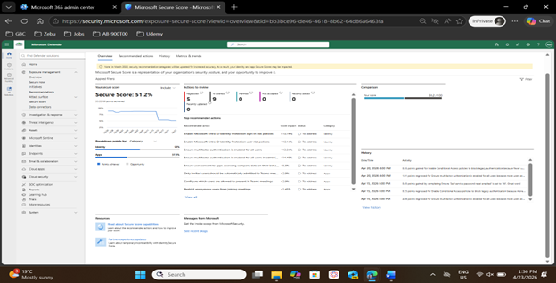
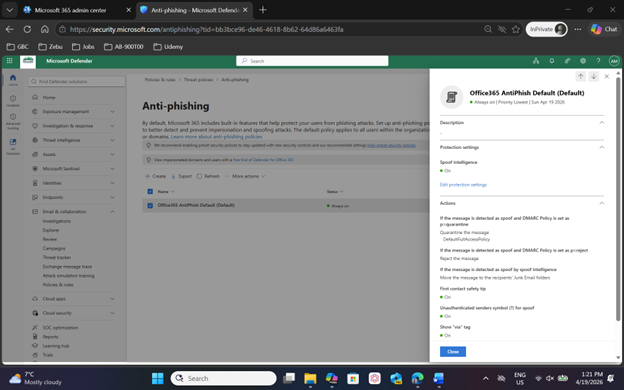

---

## 🔒 Data Protection & Compliance

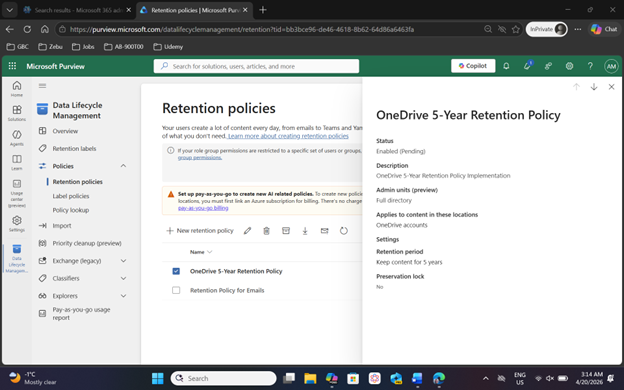

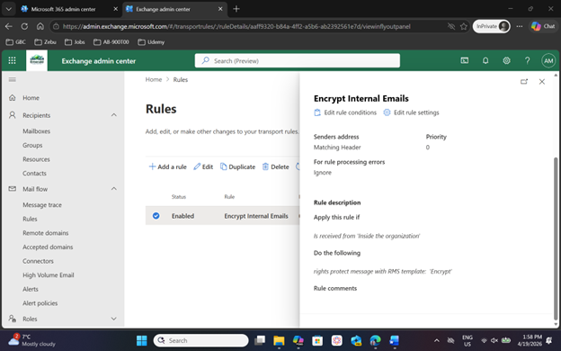

---

## 📊 Monitoring & Alerts

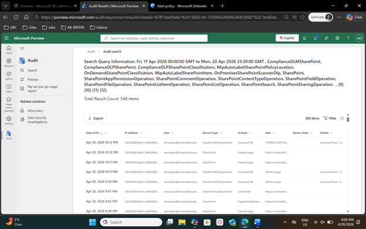
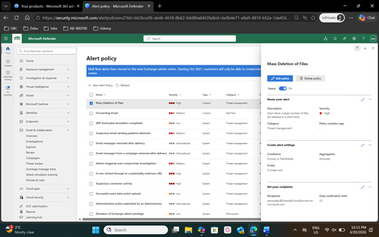

---

## 📈 Reporting & Automation

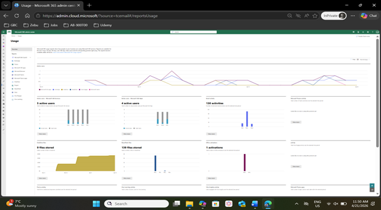
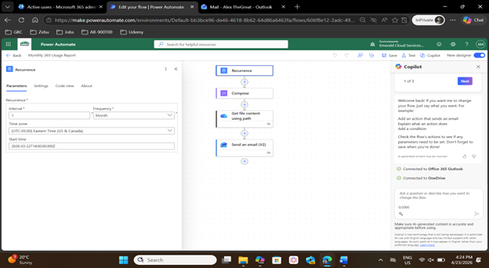

---

## 🤝 Collaboration & Supporting Configurations

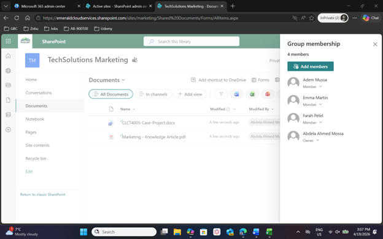
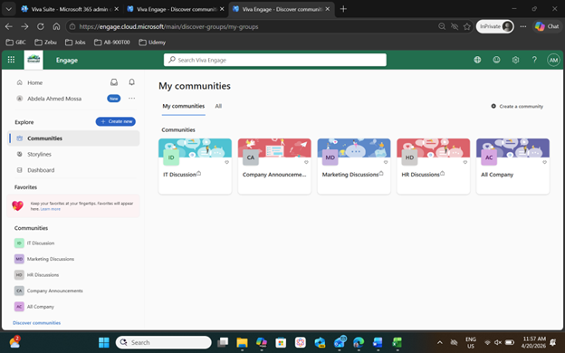

<!-- Optional / Extra Screenshots -->

<!-- 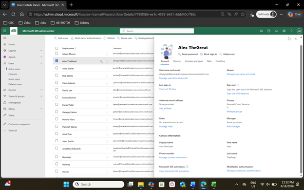 -->

<!-- 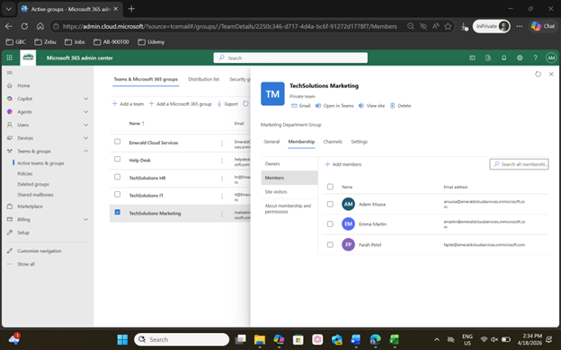 -->

---

# 🚀 Skills Demonstrated

* Cloud Security & Compliance
* Threat Detection & Protection
* Data Loss Prevention (DLP)
* Monitoring & Incident Response
* Microsoft 365 Security Administration

---

# 🎓 Academic Context

This project was completed as part of a Cloud Computing program, specifically within the **Microsoft 365 Identity and Services II – Enterprise Mobility & Security** course.

It was designed as a hands-on lab simulating real-world enterprise security and compliance scenarios.
